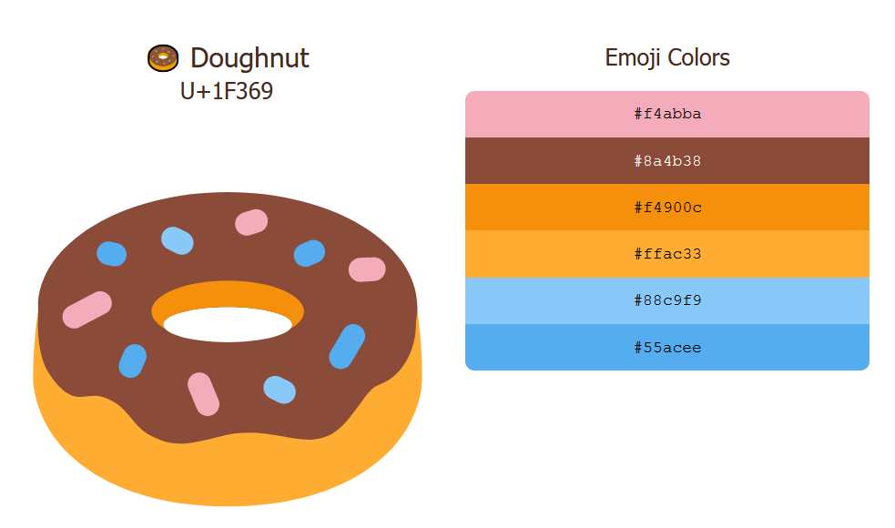
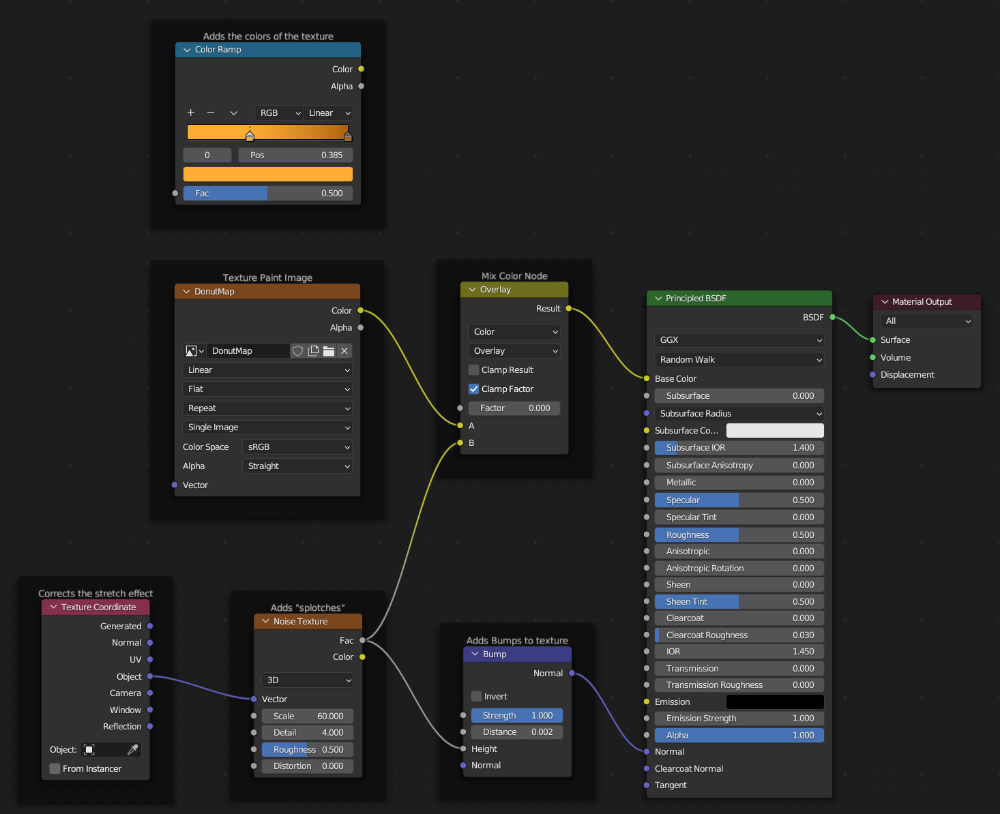

# Colors:

- Icing: #360201
- Plane: #9C0000
- Dough: #FFAC33
- Donut Shader:
  - Light: #FFAC33
  - Dark: #AD6208
- Sprinkles:
  - Final:
    - White: #FFFFFF
    - Red: #B22234
    - Blue: #0A3161
  - Version 1:
    - White: #FFFFFF
    - Red: #B22234
    - Blue: #3C3B6E
  - Version 2:
    - White: #FFFFFF
    - Red: #B31942
    - Blue: #0A3161

### Color Reference:

# Donut Material

- Add Comment: `CTRL + J`
- 
- Texture Coordinate
  - Fixes the stretch effect
  - Blender attempts to wrap the texture around the curved surfaces
  - This stops that
- Noise Texture
  - Creates the splotches for the color and bumps
  - Adjust the `Scale` for splotch size
  - Adjust `Detail` for stronger effect
- Color Ramp
  - Colors for the splotches
- Bump
  - Creates the Bump effect
  - Leave strength at 1
  - Adjust `Distance`
  - Needs to be relative to object size

# Donut Texture Painting

- Add Image Node
  - In Shading Menu:
  - Add Node: `SHIFT + A` > *Texture* > `Image Texture`
  - Click "New"
  - Set dimensions low if not needed (reduced render time)
  - Pick Starting Color
  - Don't need alpha
- Open Texture Paint at top
  - Paint onto donut image
  - MANUALLY save donut image

### Add to Donut Material

- Add `Mix Color` Node
- Disconnect `Color Ramp` Node
- 

# Ep. 9 Geometry Node Sprinkles

- In order to use geometry nodes, it has to be a modifier
  - Applying the modifier removes the nodes

### Heat / Weight Map Painting

- Select object to be painted
  - Hit: `CTRL + Tab`
  - Vertex Group in Properties > Data
  - Hide Geometry Node modifier in modifier tab
  - Paint on Icing
  - Rename heat map group
  - `CTRL + TAB` back to Object mode when done
- Have to assign the heat map to the group input
  - Select the modifier tab
  - Click the box next to the input
    - Looks like a cross in a box (Denmark Flag)
    - Click the blank text box and select the heat map

### Fix Object Sprinkles

- `Problem`: Sprinkle Objects floating over the donut
- `Fix`: Select Object > Top Bar > Object > Set Origin > Origin to Geometry 

# Animation

### Attach Icing

- CTRL click all items to attach
- Click parent last
- Hit `CTRL + P`
- Set parent to object

9C0000

