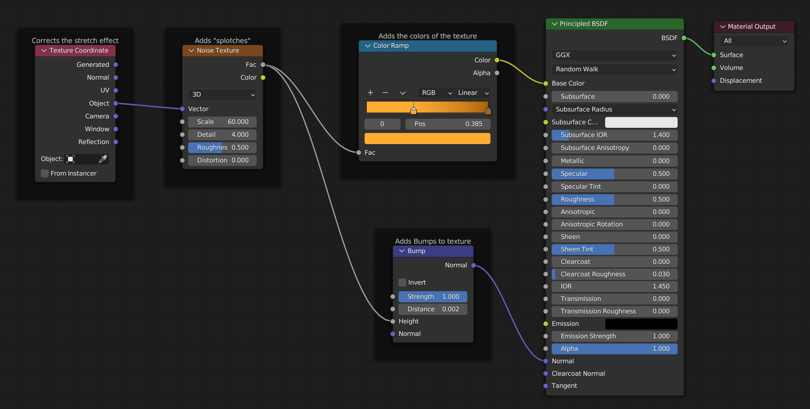

# Colors:

- Icing: #360201
- Plane: #9C0000
- Dough: #FFAC33
- Donut Shader:
  - Light: #FFAC33
  - Dark: #AD6208

### Color Reference:

# Donut Material

- Add Comment: `CTRL + J`
- 
- Texture Coordinate
  - Fixes the stretch effect
  - Blender attempts to wrap the texture around the curved surfaces
  - This stops that
- Noise Texture
  - Creates the splotches for the color and bumps
  - Adjust the `Scale` for splotch size
  - Adjust `Detail` for stronger effect
- Color Ramp
  - Colors for the splotches
- Bump
  - Creates the Bump effect
  - Leave strength at 1
  - Adjust `Distance`
  - Needs to be relative to object size

# Donut Texture Painting

- Add Image Node
  - In Shading Menu:
  - Add Node: `SHIFT + A` > *Texture* > `Image Texture`
  - Click "New"
  - Set dimensions low if not needed (reduced render time)
  - Pick Starting Color
  - Don't need alpha
- Open Texture Paint at top
  - Paint onto donut image
  - MANUALLY save donut image

### Add to Donut Material

- Add `Mix Color` Node
- Disconnect `Color Ramp` Node
- 
