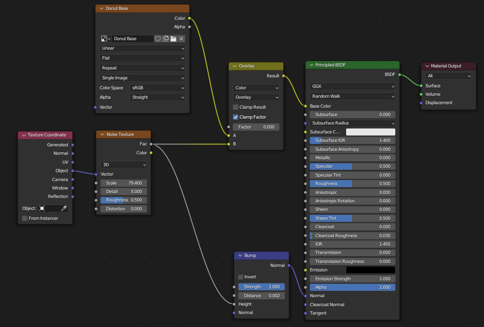
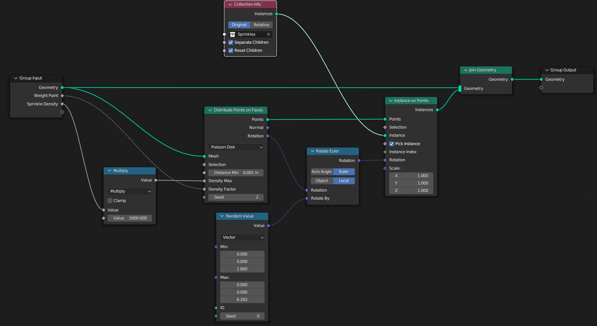
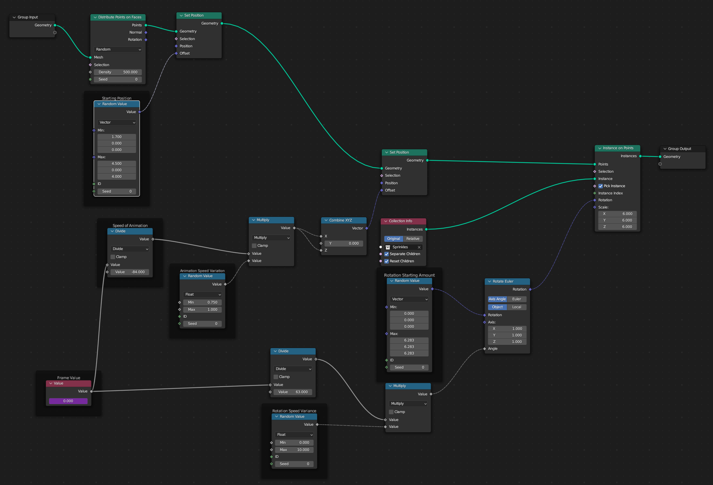

# Donut Tutorial

- Blender Guru : YouTube
- 16 Video Playlist : [First Video](https://youtu.be/nIoXOplUvAw)

# Base Donut

1. Add Base shape (torus): `SHIFT + A` > *Mesh* > shape
2. Adjust Settings in the Bottom Left
   1. Window goes away when you click off of shape
   2. Guru recommends:
      1. Major Segment: 48
      2. Minor Segment: 16
      3. Major Radius: 0.91
      4. Minor Radius: 0.61
3. Scale Donut down to size
   1. Guru recommends Dimensions: (0.1, 0.1, 0.0403)
4. Apply Scale
   1. Scale should always be (1,1,1)
   2. Hit `CTRl + A` > *Scale*

# Base Shading 

1. Change Shading
   1. `RMB` object
   2. *Shade Smooth* : smooths edges 
   3. *Shade Flat* : blocky base version

# Sub Surface modification

- AKA. Subsurf modifier
1. Click the Wrench icon, called *Modifier Properties*
2. Click *Add Modifier* > Subdivision Surface
3. Levels Viewport: increases the number of division times
   1. Higher levels increase render time

# Edit Mode

### Add Lumps to Donut

1. In Edit Mode, use Vertex Select
2. Toggle Proportional Editing
   1. KeyB: `O`
   2. Circle Icon at top
3. Grab/Scale now moves vertices around selection
4. If not working, adjust size with scroll wheel
   1. Roll Up: Decrease selection 
   2. Roll Down: Increase Selection
5. Move in Same Direction
   1. Used to scale only in the direction the faces are facing
   2. "Shrink and Fatten" Tool
   3. KeyB: `ALT + S`

# Add the Icing

- Toggle Orthographic mode: `NumPad 5`
- Look straight at the donut: `NumPad 1`
- Edit Mode
- Select half of the donut vertices
  - Can't select vertices through solid objects
  - Have to toggle X-Ray: `ALT + Z`
  - Square Icon in top right
- Duplicate the top half: `SHIFT + D`
  - Right Click to leave duplication where it started
- Have to separate duplication from original
  - Hit `P`
  - Click "By Selection"

# Rename Objects

- Double click object in the scene selection
- With Object selected in the viewport: `F2`

# Add Solidify modifier

- adds thickness
- Set "Offset" to 1
- Set "Thickness" to 0.0025
- Order of the modifiers matters
  - Applied from top to bottom
  - Move the solidify above the Subdivision

# Add Drips to Icing

- Hide Modifier in Edit Mode
  - In the modifier panel, click "Edit Mode"
  - This hides the modification in edit mode
  - Switching back to Object mode shows it again
- Have to turn on Snap mode
  - Can hold `CTRL` while moving an object
  - Or Toggle on at the top center U-Magnet 
- Next to the magnet, can change what type of snapping
- Set to "Face Nearest"
- Check "Snap to Same Target" checkbox

# Multiple Windows

- Method 1
  - Hover mouse over edge of window (double arrow cursor)
  - Right click
  - Split horizontal or vertical
  - Click cursor wherever on screen
- Method 2
  - Move cursor to top right corner
  - Cursor turns into crosshair
  - Drag and click

# Apply Modifier

- Move to the top of the modifier window
- Click dropdown arrow > Apply
- Add another sub surface modifier at the bottom after applying other

# Add Icing Drips

- Select vertices
- Extrude with `E` to drag down

# Add Donut Center Crease

- Apply sub surface modifier to donut
- Hide icing
- Hold `ALT` and click the center ring to select all vertices around donut
- Click `S` and drag inward

# Snap Icing

- Icing now floating on top of center crease
- Add modifier "Shrinkwrap" to fix
- Place at top of modifier list
- Use eye drop on donut to specify what to shrink to

# Sculpting

- Have to clear out the modifiers (apply them)
- Open "Sculpting" tab at top
- Shortcuts
  - Change Radius: `F`
  - Change Strength: `SHIFT + F`
- Sculpt Tools
  - "Grab": `G` - grab and pull out
  - Inflate: `I` - bulbous
    - Have to set brush to "Airbrush"
    - Click "Tool" on right
    - Stroke > Stroke Method > Airbrush
- Can go back to Layout mode and add another subdivision modifier if things get too jagged

# Render Camera Positioning

- Snap Camera to current view: `CTRL + ALT + NumPad`
- Using View:
  - Open toolbar with `N`
  - Click `View` tab
  - `View Lock` Section
  - Check `Lock Camera to View` box
  - The camera is now pinned to viewport
  - Any panning and rotating of the view moves the camera

# Render Engine

- Blender comes with Cycles and Eevee render engines
- Eevee
  - a real time render engine
- Cycles
  - Slower than Eevee (in real time)
  - an "offline" render engine
  - Ray Tracer / Path tracer
  - Calculates light bouncing
- Set up GPU Render
  - Top > Edit > Preferences
  - System Tab
  - Cuda / OptiX (NVIDIA choices)
  - Use "OptiX" if you have both
  - Properties > Render > Scene > Device > Set to GPU

# Adjust Eevee Settings

- Can raise the shadow Resolution
  - (right side) Render > Shadows
  - Raise `Cube Value` for a better shadow
- Adjust Light Shadows
  - Select Light Object
  - (right side) Data > Shadow > Bias
  - For small objects, set to a low value
  - 0.001 for Donut
- Ambient Occlusion
  - Done by default by Cycles, has to be turned on for Eevee
  - (right side) Render > Ambient Occlusion
- Reflections
  - (right side) Render > Screen Space Reflections
  - Reflections colors

# Set Material Preview Mode

- Makes the material preview mode look like Render Preview
- (top right) click "Material Preview mode"
- Click the dropdown arrow to the right
- Check "Scene Lights"
- Check "Scene World"
- Material Preview should now be identical to render preview
  - Can keep rendering set to Cycles without having to wait for rendering

# Reduce Noise

- Noise is the static/fuz as the render creates samples
- Render > Sampling > Denoise checkbox
- Can set Viewport Samples to 100
- Can set Denoise > Start Sample to 50

# Materials

- [Color Theme](https://colorpalettes.net/color-palette-4474/)
- Add a new Material
  - Click object
  - (right side) Material > New
- Color
  - Base Color: sets the main color
  - Roughness: ranges from glossy (0 value) to matte (max value)
    - 0.150 for demo

### Subsurface Scattering

- Light through fingers example
- (right side) Material > Subsurface
- Value of 1 is "1 meter" penetration
- Subsurface Radius
  - 3 values represent Red Green Blue
- Subsurface Color
  - (possibly) set to a more saturated value than the base color

### Donut Material

- Open shading tab at top
- Add in Node: `SHIFT + A` or Add
- Add *Texture* > `Noise Texture`
  - This is used a lot
- Remove node connection: `CTRL + RMB`
- Add: *Converter* > `Color Ramp`
- Add: *Input* > `Texture Coordinate`
- Add: *Vector* > `Bump`
  - Change distance to adjust what bumps get colored
  - In Blender units: value of "1" is "1 meter"

# Texture Painting

- At the top bar
- In Shading Menu:
  - Add Node: *Texture* > `Image Texture`
  - Click "New"
  - Set dimensions low if not needed (reduced render time)
  - Pick Starting Color
  - Don't need alpha
- Paint onto object
- Same keybinds as before
  - `F + Mouse` adjust radius
  - `SHIFT + F + Mouse` adjust strength
- Have to manually save the image 

### Color Bump

- Go back to Shading
- Add: *Color* > *Mix Color*

### Donut Shader Map:

# Ep9: Sprinkles & Geometry Nodes

- Create a workspace for Geometry Node Editor:
  - Click "+" icon at end of top navbar
  - General > Geometry Nodes
- CLick "New" with the icing selected
  - Adds a new Geometry node in the Modifier stack
  - To use Geometry Nodes, it has to be a modifier
  - Have to click the modifier tab to view the nodes
    - Can click the pin to keep it

### Sprinkles

- "Distribute Points on Faces"
  - Distributes points across the face of the icing
  - Have to set high density because the area is very small
- "Join Geometry"
  - Allows you to have both the original mesh and the distributed points
- Add Mesh for sprinkle
  - Add mesh like normal (Shift a)
  - Used a cylinder for the standard shape
  - Apply Scale after setting size
- "Instance on Points"
  - Creates instances of the mesh on the points
- "Object Info"
  - Add the mesh (sprinkle)
  - Sets all the points to the mesh shape
- "Rotate Euler"
  - rotates the points
- "Random Value"
  - Outputs random values
  - Vector measured in radians, not degrees (pi/tau)

### Weight Paint

- Open with: `CTRL + TAB`
- Easier to see with sprinkles/geometry node turned off
- Edit in Properties > Data
- Paint on heat map
  - Blue low 
  - Red High
- Apply heat map to sprinkles
  - Drag "density" on Distribute points on faces to Group Input
  - Adds a density value
  - In the modifier tab, apply the heat map group to the density
  - Add a Utilities > Math > Multiply node in between
    - This is how you can get the 10,000 values like before

### Poisson Disk

- Distribute Points on Faces
- Change "random" to "Poisson Disk"
- Set distance min to something (0.001)
- Drag Group input Density > Density Factor
- Drag Group input Value > Density max

### Final Nodes

# Ep 10. Sprinkles Cont.

### Reshape sprinkle

- Add subdivision modifier to sprinkle
- Circle cut `CTRL + R` sprinkle at both ends
- Make multiple shapes however
- Put all shapes into a Collection

### Add to Donut

- Drag Collection into Geometry Node
  - Check "Separate Children"
  - Check "Reset Children"
- Drag to Instance on Points (Instance)
  - Check "Pick Instance"

# Ep 11. Animation

### Parenting

- Select objects with `CTRL`
  - Select parent object last
- Hit `CTRL + P`
- Click Object with Transformation

### Change camera perspective

- Move view to current camera position: `NumPad 0`
- Camera resolution determined by output resolution
- Clipping Distance: 
  - Properties > Object Data Properties > Lens
- Focal Length
  - High: flatten image, compress depth
  - Lower: More depth
- Camera Grid:
  - Properties > Object Data Properties > View Port Display > Composition Guide

### Animation

- Insert Keyframe: `I` (India)
  - Use Location or Rotation
- Show every frame
  - animation lags
  - Bottom left > Play back > Sync > Frame Dropping
- Animation Tab
  - `CTRL + Middle Mouse Button` - adjust graph scale

# Ep 12. Floating Particles

- Type "#frame" in the value node for frames
  - After typing "#frame" don't type in a number
  - Use `SHIFT + R/L Arrow` to change value (or don't change at all)
  - Can `RMB` and "Delete Driver" to start over

### Add A Comment

- Can add a comment to a geometry node
- Hit `CTRL + J` or `SHIFT + A` > Layout > Frame

