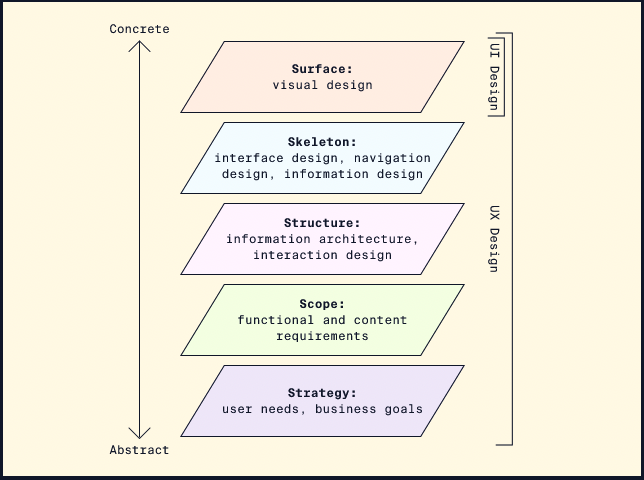

# UI and UX Design

# Table of Contents

<!-- @import "[TOC]" {cmd="toc" depthFrom=1 depthTo=6 orderedList=false} -->

<!-- code_chunk_output -->

- [UI and UX Design](#ui-and-ux-design)
- [Table of Contents](#table-of-contents)
- [Sources](#sources)
    - [Codecademy: UI & UX](#codecademy-ui--ux)
    - [Codecademy: Learn Design Thinking](#codecademy-learn-design-thinking)
- [What are UI and UX Design](#what-are-ui-and-ux-design)
- [Five Elements of UX Design](#five-elements-of-ux-design)
    - [Strategy](#strategy)
    - [Scope](#scope)
    - [Structure](#structure)
    - [Skeleton](#skeleton)
    - [Surface](#surface)

<!-- /code_chunk_output -->

# Sources

### [Codecademy: UI & UX](https://www.codecademy.com/learn/intro-to-ui-ux)

### [Codecademy: Learn Design Thinking](https://www.codecademy.com/learn/learn-design-thinking-ideation)

# What are UI and UX Design

- User Interface (UI) Design
  - Layout
  - Colors
  - Typography
  - Interaction Design
  - Brand Identity
  - Responsiveness and usability
  - Accessibility and inclusivity
  - Front-end development
- User Experience (UX) Design
  - describes the entire experience around a product or service
  - User's emotional state, the context or environment, designed system or artifact
- User experience design is a human-centered design discipline that addresses the holistic experience of a product. Focuses on:
  - User Journey - the entire process surrounding use of a product
  - User Research - Qualitative and quantitative research to put the user at the center of the design process
  - Deliverables - to document the user experience and define the workflows and features of a product or design:
    - Personas: summaries of example and target users, generally based on a composite of user research
    - Journey Maps: a timeline of user actions related to accomplishing a particular goal related to a product or design
    - Storyboards: a sequence of panels (or comic books) depicting a user story chronologically
    - Prototypes: iterative models, sketches or wireframes of a design used to gather feedback and inform the final design

[Back to top](#table-of-contents)

# Five Elements of UX Design

- From Jesse James Garrett
- Shows the layered steps required to turn an idea into a functional product
- Each layer of the model building upon another from bottom up

### Strategy

- Takes into consideration both user needs and business goals
- Most abstract
- **Ex**: Mobile Phone - who is the target audience. Smartphones with a smaller form factor might target users who are frequently on the go

### Scope

-

### Structure

-

### Skeleton

-

### Surface

-

[Back to top](#table-of-contents)

