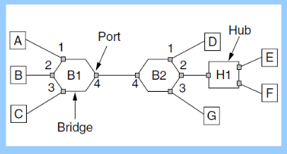

# 522 Networking

- Fall 2022
- Elsa Poh

# Table of Contents

- [522 Networking](#522-networking)
- [Table of Contents](#table-of-contents)
- [10/19 Class Notes](#1019-class-notes)
    - [Example 1](#example-1)
    - [Example 2](#example-2)
    - [Classic Ethernet](#classic-ethernet)
    - [Standards](#standards)
    - [Collision-Free](#collision-free)
    - [Wireless LAN Protocols](#wireless-lan-protocols)
    - [Wireless Networks: IEEE 802.11](#wireless-networks-ieee-80211)
    - [Build on Bridge hash table](#build-on-bridge-hash-table)
- [10/24 Class Notes](#1024-class-notes)
    - [Bridges](#bridges)
    - [Exam Review](#exam-review)

# 10/19 Class Notes

- Binary Exponential Backoff
  - If a station's frame collides, the random amount of time it will wait to try again is given by:
    - After *n* collisions, wait anywhere from 0 to $2^{n}-1$ slots if $n \le 10$
      - 1st collision: wait 0 or 1 slots
      - 2nd collision: wait 0, 1, 2, or 3 slots
      - 3rd collision: wait 0, 1, 2, 3, 4, 5, 6, or 7 slots
    - If $n \ge 10$, wait between 0 and $2^{10}$ slots

### Example 1

- Suppose two devices using CSMA/CD and the binary exponential backoff algorithm have just sent transmissions that have each experienced collision **twice**. What is the probability that both devices will transmit successfully during the next two time slots?
- Binary Exponential Backoff:
- Given:
  - 2 devices
  - 2 collisions each 
  - (collisions are associated per frame, not per device)
- Find:
  - Probability (success in slots 0, 1)
- Solve:
  - Pr = Probability
  - = Pr(device1 chooses 0) * Pr(device2 chooses 1) + Pr(device1 chooses 1) * Pr(device2 chooses 0)
  - = 0.25(0.25) + 0.25(0.25)
  - = 0.125
- Pr(no collision in next slot(0)):
  - = Pr(neither chooses 0 ) + Pr(exactly 1 device chooses 0)
  - = [Pr(dev1 chooses 1 or 2 or 3) * Pr(dev2 chooses 1 or 2 or 3)] + [Pr(dev1 chooses 0) * Pr(dev2 chooses 1,2 or 3)] + [Pr(dev2 chooses 0) * Pr(dev1 chooses 1, 2, or 3)]
  - = 0.75(0.75) + 0.25(0.75) + 0.25(0.75)
  - = 0.9375
- Pr(collision in next slot):
  - = Pr(both choose 0)
  - = 0.25 * 0.25
  - = 0.0625

### Example 2

- Let A and B be two stations attempting to transmit on a CSMA/CD network. Each has a steady queue of frames ready to send: A's frames will be numbered A1, A2, etc. B's frames similarly. Let T be the exponential backoff base unit, that is, the duration of one slot.
- Suppose A and B simultaneously attempt to send frame 1, collide, and happen to choose backoff times of 0'T or 1'T, respectively, meaning A wins the race and transmits A1 while B waits. At the end of this transmission, B will attempt to retransmit B1 while A will attempt to transmit A2. These first attempts will collide, but now A backs off for either 0'T or 1'T, while B backs off for time equal to one of 0'T, 1'T, 2'T, or 3'T.
- What is the probability that A wins this second backoff race immediately after this first collision; that is, A's first choice of backoff time k'51.2 is less that B's?
- Given:
  - A1 choose 0 | A2 chooses between {0,1}
  - B1 choose 1 | B1 chooses between {0,1,2,3}
- Solve:
  - Pr(A wins second backoff race) = Pr(A2 will choose slot < B1)
  - = Pr(A2 chooses 0) * Pr(B1 chooses 1,2,3) + Pr(A2 chooses 1) * Pr(B1 chooses 2, 3)
  - = 0.5(0.75) + 0.5(0.5)
  - = 0.625 

### Classic Ethernet

- Efficient for large frames, even with many senders
  - Degrades for small frames (and long LANs)
- Hubs wire all lines into a single CSMA/CD domain
- Switches isolate each port to a separate domain
- Much greater throughput for multiple ports
- No need for CSMA/CD with full-duplex lines
- Switches can be wired to computers, hubs, and switches
  - Hubs concentrate traffic from computers
- Fast ethernet extended Ethernet from 10 to 100 Mbps
  - Twisted pair (with Cat 5) dominated the market

### Standards

- 100BaseTX
  - uses Cat-5 UTP
  - 4B/5B encoding with MLT-3
  - MLT-3 signaling
  - 100 meter max length
- 100BaseFX
  - Uses multimode optical fiber
  - 2km max length
  - Same as 100BaseTX with NRZI
- 100BaseT4
  - Uses Cat-3 UTP
  - 8B/6T encoding
  - Sending data over 4 pairs of wires
- Gigabit / 10 Gigabit Ethernet
  - Switches Gigabit Ethernet is now the garden variety with full-duplex lines between computers/switches
  - Gigabit Ethernet is commonly run over twisted pair
  - 10 Gigabit Ethernet is being deployed where needed
  - 40/100 Gigabit Ethernet is under development

### Collision-Free

- Bitmap
  - Collision-free protocols avoid collisions entirely
    - Senders must know when it is their turn to send
  - The basic bit-map protocol:
    - Sender set a bit in contention slot if they have data
    - Senders send in turn; everyone knows who has data
- Token Ring
  - Token sent round ring defines the sending order
    - Station with token may send a frame before passing
    - Idea can be used without ring too, e.g., token bus
- Token Ring: IEEE 802.5
  - Data rates: 4 Mbps and 1 Mbps
    - IBM: 4, 16, or 100 Mbps
  - Differential Manchester encoding technique
  - Uses a token to handle contention
  - A station can only send directly to its neighbors; usually to only one neighbor
  - To send a frame, a sation waits for the token to arrive, claims token, sends the frame, waits for frame to return to sending station, regenerates the token and sends it back to the ring
  - Each station examines the destination address field of each frame and compares it with own address; if the addresses match, then set some flags and send the frame back to the ring
- Token Passing
  - Assume:
    - 20 stations separated by 10 meters each; total ring length = 200 meters
    - Transmission rate = 4Mbps; 0.25$\mu$/sec per bit
    - Propagation speed = 200 m/$\mu$sec
  - Each station introduces one bit-time delay
  
### Wireless LAN Protocols

- Wired has complications compared to wired
- Nodes may have different coverage regions
  - Leads to <u>hidden</u> and <u>exposed</u> terminals
- Nodes can't detect collisions, i.e., sense while sending
  - Makes collisions expensive and to be avoided
- **Hidden Terminals**
  - hidden terminals are senders that cannot sense each other but nonetheless collide at intended receiver
    - Want to prevent; loss of efficiency
    - A and C are hidden terminals when sending to B
- **Exposed Terminals**
  - exposed terminals are senders who can sense each other but still transmit safely (to different receivers)
    - Desirably concurrency; improves performance
    - $B\rArr A$ and $C\rArr D$ are exposed terminals
- **MACA**
  - MACA protocol grants access for A to send to B:

### Wireless Networks: IEEE 802.11

- Uses spread spectrum technology 
  - Frequency hopping spread spectrum
  - Direct-sequence spread spectrum
    - Chipping sequence (11-bit Barker code)
- 802.11 Architecture/Protocol Stack
  - Wireless clients associate to a wired AP (access point)
    - Called infrastructure mode; there is also ad-hoc mode with no AP, but that is rare
  - MAC is used across different physical layers

### Build on Bridge hash table

- Consider:
  - (a) A sends a packet to C
  - (b) E sends a packet to F

- (a) 
  - B1 $\rArr$ 2,3,4 outgoing ports
  - B2 $\rArr$ 1,2,3
  - C $\rArr$ A B1 $\rArr$ 1
- (b)
  - E $\rArr$ F
  - B2 $\rArr$ 1,3,4
  - B1 $\rArr$ 1,2,3

[Back to Top](#table-of-contents)

# 10/24 Class Notes

### Bridges

- Bride topologies with loops and only backward learning will cause frames to circulate forever 
  - Need spanning tree support to solve problem
- Spanning Tree
  - After the algorithm runs:
  - Set B1 as the root, two dashed links are turned off
  - B4 uses link to B2 (lower than B3 at the same distance)
  - B5 uses B3 (distance 1 versus B4 at distance 2)
- LAN Bridge
  - Set the lowest address bridge to the root (B1)
  - Identify the root ports based on distance and lowest value of address
  - Designate Bridges
    - Always take the bridge that's closer to the root.
    - If the distance is the same, take the one with the lower address
    - Can deactivate any connection that won't be sending data 
    - LAN A - B2
    - LAN B - B1
    - LAN C - B2
    - LAN D - B1
    - LAN E - B1
    - LAN F - B5

### Exam Review

- Coverage
  - Chapters 3, 4, TCP/UDP socket programming
- Topics
  - Socket Programming
    - Functions associated with the client/server exchange
  - Terminologies
  - Framing
    - Byte Count, bit stuffing, byte stuffing
  - Error control
    - Checksum
    - hamming code
    - CRC
  - FEC vs ARQ
  - Flow Control
    - Stop-and-wait
    - sliding window
      - go-back-n
      - SRP
  - Keeping the pipe full
  - Channel allocation
  - Multiple access protocols
    - Pure Aloha/Slotted Aloha
    - CSMA
      - Persistence
    - CSMA/CD
      - Binary exponential backoff
    - Ethernet
      - classic ethernet, fast-, gigabit-, etc
    - Collision-free
      - bit-map, token ring/bus
    - Wireless LANs
      - IEEE 802.11
  - Bridges
    - Learning Bridge
  - Spanning Tree Algorithm

[Back to Top](#table-of-contents)

