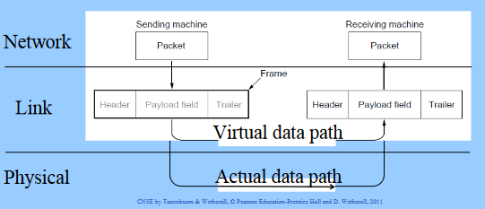
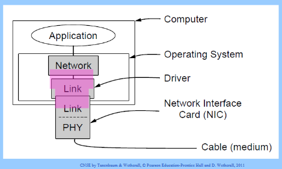
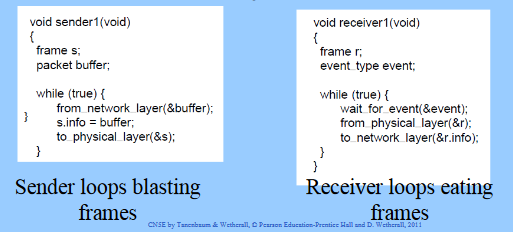
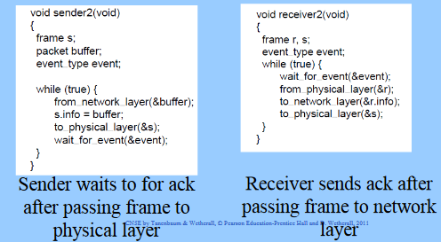
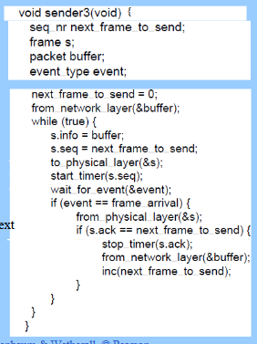
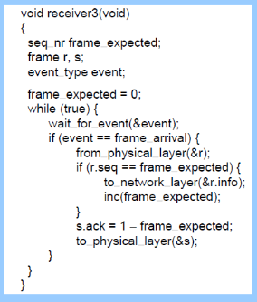
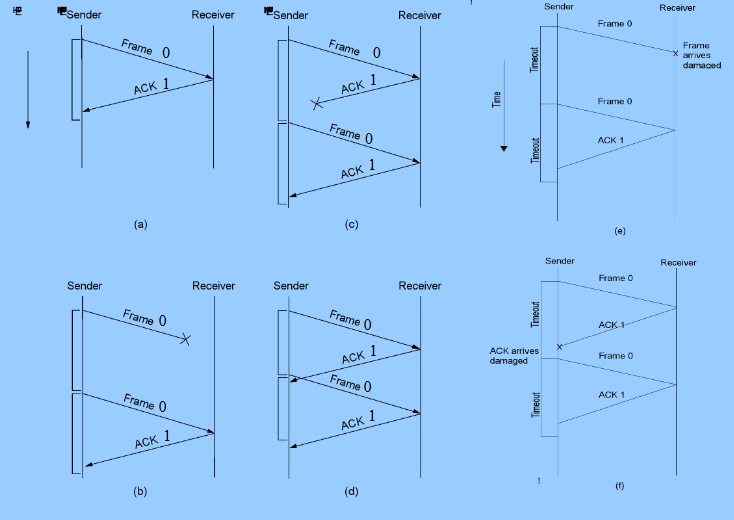

# 522 - Computer Networking Principles

- Fall 2022
- Elsa Poh

# Table of Contents

- [522 - Computer Networking Principles](#522---computer-networking-principles)
- [Table of Contents](#table-of-contents)
- [09-21 Notes](#09-21-notes)
    - [Switching Strategies](#switching-strategies)
    - [End-to-end Delays / Circuit Switching](#end-to-end-delays--circuit-switching)
    - [Message Switching](#message-switching)
    - [Datagram Packet Switching](#datagram-packet-switching)
    - [Virtual Circuit Packet Switching](#virtual-circuit-packet-switching)
    - [Example](#example)
    - [Socket Programming Files](#socket-programming-files)
    - [Socket Programming Notes](#socket-programming-notes)
- [10/05 Notes - Data Link Layer](#1005-notes---data-link-layer)
    - [Frames](#frames)
      - [Possible Services](#possible-services)
    - [Framing Methods](#framing-methods)
      - [Framing-Byte Count](#framing-byte-count)
      - [Framing-Flag bytes with Byte Stuffing](#framing-flag-bytes-with-byte-stuffing)
      - [Framing-Bit Stuffing](#framing-bit-stuffing)
    - [EX) Data Link Layer](#ex-data-link-layer)
    - [Data Link Protocols](#data-link-protocols)
      - [Error Control](#error-control)
      - [Flow Control](#flow-control)
    - [Elementary Data Link Protocols](#elementary-data-link-protocols)
      - [Link Layer Environment](#link-layer-environment)
      - [Utopian Simplex Protocol](#utopian-simplex-protocol)
      - [Stop-and-wait: Error-free channel](#stop-and-wait-error-free-channel)
      - [Stop-and-wait: Noisy Channel](#stop-and-wait-noisy-channel)
      - [Stop-and-wait Protocol](#stop-and-wait-protocol)
      - [Protocol Efficiency](#protocol-efficiency)
    - [Channel Utilization](#channel-utilization)
    - [Effective Data Rate, E](#effective-data-rate-e)
- [10/10 Notes](#1010-notes)
    - [Sliding Winfow Protocols](#sliding-winfow-protocols)
    - [Go-Back-N ARQ](#go-back-n-arq)
    - [Damaged Frame](#damaged-frame)
    - [Go-Back-N Protocol](#go-back-n-protocol)

# 09-21 Notes

### Switching Strategies
- **B**: bit rate (bits per second)
- **M**: message size (bits)
- **N**: number of packets
- **O**: overhead bits (bits)
- **K**: packet size including overhead (bits)
- **P**: propagation rate (meters per second)
- **D**: length of one hop (meters)
- **H**: number of hops
- **S**: setup time for CKT switching and virtual packet switching (seconds)

### End-to-end Delays / Circuit Switching

- Call setup
- Transmission Delay - how long it will take to transmission based off of (message size / bit rate)
- Propagation Delay - (distance / Propagation Rate)
$$T_{ckt} = S + \frac{M}{B} + (H * \frac{D}{P})$$

### Message Switching

$$T_{MSG} = H * (\frac{M}{B} + \frac{D}{P})$$

### Datagram Packet Switching

$$T_{DGRAM} = \frac{N*K}{B} + \frac{D}{P} + (\frac{K}{B} + \frac{D}{P}) * (H - 1)$$

$$T_{DGRAM} = ((N + H - 1) * \frac{K}{B}) + (H * \frac{D}{P})$$

### Virtual Circuit Packet Switching

$$T_{VC} = S + T_{DGRAM}$$

### Example
- Message size = 1 Mbits
- Bit rate = 100 Mbps
- Packet Size = 10 kbits
- Packet Overhead = 200 bits
- Prop Rate = 2.8 * 10<sup>8</sup> m/sec
- Length of 1 hop = 2 km
- Number of hops = 5 hops
- Setup Time = 0.2 msec

- Step 1:
$$T_{CKT} = S + \frac{M}{B} + (H * \frac{D}{P})$$
$$T_{CKT} = 0.2*10^{-3}sec + \frac{1 * 2^{20} bits}{100 * 10^{6} bits/sec} + \frac{5 * 2*10^{3}meters}{2.8*10^{8}meters/sec}$$
$$T_{CKT} = 0.01072 sec$$

- Step 2:
$$N = \frac{M}{K-O}$$
$$N = \frac{1 * 2^{22} bits}{(10 * 2^{10} bits) - 200 bits}$$
$$N = 104.44 = 105 packets$$

- Step 3:
$$T_{DGRAM} = (105 + 5 - 1) * (\frac{10,240bits}{1*10^{6}bits/sec}) + (5*(\frac{2*10^{3}meters}{2.8*10^{8}meters/sec}))$$
$$T_{DGRAM} = 0.0111 sec$$

- Step 4:
$$T_{VC} = 0.2*10^{-3}sec + T_{DGRAM} = 1.1162sec$$

- Step 5:
$$T_{MSG} = 5*((\frac{1*2^{20}bits}{100*10^{6}bits/sec})+(\frac{2*10^{3}meters}{2.8*10^{8}meters/sec}))$$

### Socket Programming Files

- Files > Doc Sharing > Socket Programming > Sample Socket Code.zip
- TCPEchoClient.c
- TCPEchoServer.c
- UDPEchoClient.c
- UDPEchoServer.c
- HandleTCPClient.c

### Socket Programming Notes

- IP Address
    - Datagram (packet) protocol
    - 32-bit identifier 
    - Dotted-quad: 192.118.56.25
    - Identifies a host interface 
- Transport Protocols
    - Add services on top of IP
    - User Datagram Protocol (UDP)
        - Data checksum
        - Best-effort
    - Transmission Control Protocol (TCP)
        - Data checksum
        - Reliable byte-stream delivery

# 10/05 Notes - Data Link Layer

- Responsible for delivering frames of information over a single link
  - Handles transmission errors and regulates the flow of data

### Frames

- Link layer accepts packets from the network layer, and encapsulates them into frames that it sends using the physical layer; reception is the opposite process
  - 

#### Possible Services

- Unacknowledged connectionless service 
  - Frame is sent with no connection / error recovery
  - Ethernet is example
- Acknowledged connectionless service
  - Frame is sent with retransmissions if needed
  - Example is 802.11
- Acknowledged connection-oriented service
  - Connection is set up; rare

### Framing Methods

- Byte Count
- Flag bytes with byte stuffing
- Flag bits with bit stuffing
- Physical layer coding violations
  - Use non-data symbol to indicate frame

#### Framing-Byte Count

- Frame begins with a count of the number of bytes in it
- Simple but difficult to resynchronize after an error

#### Framing-Flag bytes with Byte Stuffing

- Special flag bytes delimit frames; occurrences of flags in the data must be stuffed (escaped)
  - Longer but easy to resynchronize after error
  
#### Framing-Bit Stuffing

- Stuffing done at the bit level
  - Frame flag has six consecutive 1s (not shown)
  - On transmit, after five 1s in the data, a 0 is added
  - On receive, a 0 after five 1s is deleted

### EX) Data Link Layer

- Chapter 3, question 2 problem
- The following character encoding is used in a data link protocol:
  - A: 0100 0111
  - B: 1110 0011
  - FLAG: 0111 1110
  - ESC: 1110 0000
- Show the bit sequence transmitted (in binary) for the four-character frame A B ESC FLAG when each of the following framing methods is used:
- (a) Byte Count:
```
5           A           B           Esc         Flag
0000 0101   0100 0111   1110 0011   1110 0000   0111 1110
```
- (b) Flag bytes with byte stuffing:
- Add flag at start and end
```
FLAG    A   B   ESC     FLAG    FLAG
```
- (c)
- Every time you see 5 ones, the next bit is a zero 
```
FLAG A B ESC FLAG FLAG
```

### Data Link Protocols

- to provide, establish, and maintain effective communications
  - Error Control: specification of how a station checks frames for errors and what it does if it finds them
    - Forward Error Correction
    - Automatic Repeat Request
  - Flow Control: protocol that regulates the exchange of information between two devices

#### Error Control

- Error control repairs frames that are received in error
  - Requires errors to be detected at the receiver
  - Typically retransmit the unacknowledged frames
  - Timer protects against lost acknowledgements

#### Flow Control

- Prevents a fast sender from out-pacing a slow receiver
  - Receiver gives feedback on the data it can accept
  - Rare in the Link layer as NICs run at "wire speed"
  - Receiver can take data as fast as it can be sent

### Elementary Data Link Protocols

- Link Layer Environment
- Utopian Simplex Protocol
- Stop-and-wait Protocol for Error-free channel
- Stop-and-wait Protocol for Noisy channel

#### Link Layer Environment

- Commonly implemented as NICs and OS drivers: network layer (IP) is often OS software
- 

#### Utopian Simplex Protocol

- An optimistic protocol (p1) to get us started
- Assumes no errors, and receiver as fast as sender
- Considers one-way data transfer
- 

#### Stop-and-wait: Error-free channel

- Protocol (p2) ensures sender can't outpace receiver
- Receiver returns a dummy frame (ack) when ready
- Only one frame out at a time, called **stop-and-wait**
- Added flow control:
- 

#### Stop-and-wait: Noisy Channel

- ARQ - Automatic Repeat reQuest
  - Adds error control
  - receiver acks frames that are correctly delivered 
  - Sender sets timer and resends frame if no ack
- For correctness, frames and acks must be numbered
  - Else receiver can't tell retransmission (due to lost ack or early timer) from new frame
  - For stop-and-wait, 2 numbers (1 bit) are sufficient
- Sender Loop (p3):
  - Send frame (or retransmission)
  - Set timer for retransmission
  - Wait for ack or timeout
  - If a good ack then set up for the next frame to send (else the old frame will be retransmitted)
  - 
- Receiver Loop (p3)
  - Wait for a frame
  - If it's new then take it and advance expected frame
  - Ack current frame
  - 

#### Stop-and-wait Protocol

- Sender transmits one frame and waits for acknowledgment (ACK) before transmitting next frame
- Transmission scenarios:
  - (a) Frame arrives intact and on time
  - (b) Lost data frame
  - (c) Lost acknowledgment frame
  - (d) Delayed acknowledgment frame
  - (e) Damaged frame
  - (f) Damaged acknowledgment frame
- 

#### Protocol Efficiency

- Channel Utilization - the percentage of time the channel is busy transferring data frames
- Effective Data rate - the actual number of data bits sent per unit of time
- Link layer protocol implementations use library functions
- Define:
  - R: transmission rate (10 Mbps = 10 bits/usec)
  - S: signal (propagation) speed (200 meters per usec)
  - D: distance between sender and receiver (200 meters)
  - T: time to create one frame (1 usec)
  - F: number of bits in a frame (200)
  - N: number of data bits in a frame (160)
  - A: number of bits in an acknowledgment (40)

### Channel Utilization

- Define time elapsed between sending two consecutive frames:
  - Unrestricted protocol
$$time=T+\frac{F}{R}$$
  - Stop-and-wait protocol
$$time=(T+\frac{F}{R}+\frac{D}{S})+(T+\frac{A}{R}+\frac{D}{S})$$
$$=2(T+\frac{D}{S})+\frac{F+A}{R}$$

- P=Percentage time frame bits occupy channel
- P(unrestricted protocol)
$$P=100*\frac{\frac{F}{R}}{T+\frac{F}{R}}$$
$$P=100*\frac{\frac{200bits}{10bits/\mu sec}}{1\mu sec+\frac{200bits}{10bits/\mu sec}}$$
$$P\approx95\%$$

- P(stop and wait Protocol)
$$P=100*\frac{\frac{F}{R}+\frac{D}{S}}{2*(T+\frac{D}{S})+\frac{F+A}{R}}$$
$$P=100*\frac{\frac{200bits}{10bits/\mu sec}+\frac{200meters}{200meters/\mu sec}}{2*(1\mu sec+\frac{200meters}{200meters/\mu sec})+\frac{200bits+40bits}{10bits/\mu sec}}$$
$$P\approx75\%$$

### Effective Data Rate, E

- E (Unrestricted Protocol)
$$E=\frac{N}{T+\frac{F}{R}}$$
$$E=\frac{160bits}{1\mu sec+\frac{200 bits}{10bits/\mu sec}}$$
$$E\approx7.6bits/\mu sec$$
$$E\approx7.6Mbps$$
- E (Stop and wait Protocol)
$$E=\frac{N}{2*(T+\frac{D}{S})+\frac{F+A}{R}}$$
$$E=\frac{160bits}{2*(1\mu sec+\frac{200 meters}{200meters/\mu sec})+\frac{200bits+40bits}{10bits/\mu sec}}$$
$$E\approx5.7bits/\mu sec$$
$$E\approx5.7Mbps$$

# 10/10 Notes

- Error Control Utilities
  - 1) Sequence numbers
  - 2) Positive and negative acknowledgments, ack x NAK x, where x is the sequence # of next frame expected
  - 3) timer for frame(s) sent

### Sliding Winfow Protocols

- Sender maintains window of frames it can send
  - Needs to buffer them for possible retransmission
  - Window advances with next acknowledgements
- Receiver maintains window of frames it can receive
  - Needs to keep buffer space for arrivals
  - Window advances with in-order arrivals
- Larger windows enable *pipelining* for efficient link use
  - Stop-and-wait (w=1) is inefficient for long links
  - Best window (w) depends on bandwidth-delay (BD)
  - Want w $\ge$ 2BD+1 to ensure high link utilization
- Pipelining leads to different choices for errors/buffering
  - We will consider *Go-Back-N* and *Selective Repeat*
- Allow multiple unacknowledged (outstanding) frames
- Upper bound on outstanding frames, called *window*
- Frames are numbered (sequence numbers)
- Go-Back-n: requires frames to be received in the same order they are sent
- Selective Repeat Protocol: requires the receiver to be able to buffer frames received out of order

### Go-Back-N ARQ

- Discards out-of-order or damaged frames and sends a NAK
- Otherwise, send cumulative ACKs (RR)
- Acknowledgments may be piggybacked in a data frame; uses ACK timer
- Sending station keeps a frame timer for each frame sent; timeout triggers a retransmission of the last *n* frames sent

### Damaged Frame

1. Damaged Frame
   1. A transmits frame *i*
      1. B detects error and sends Nak
   2. Frame *i* lost in transit
      1. A sends frame *i+1*
      2. B receives frame *i+1* out of order & sends $NAK_{i}$
      3. A retransmits from frame *i* in window
   3. Frame *i* is lost and A does not send additional frames
      1. B does not do anything
      2. A's frame timer expires and sends *Receive Ready (RR)*
2. Damaged ACK (RR)
   1. B receives frame *i* and send ACK i+1 which is lost in transit
      1. No problem if subsequent ACK arrives at A before timer expires
   2. A's frame timer expires and sends RR to B and starts a Polling timer
      1. B should respond with ACK
3. Damaged NAK
   1. same as 1.3

### Go-Back-N Protocol

- Max Window Size = $2^{k}-1$
  - where *k* = number of bits used for frame sequence numbers
- Sequence number field is finite; sequence numbers wrap around
- Sequence number space must be larger than number of outstanding frames
- Max window size = $2^{k}$ is not sifficient
  - Suppose 3-bit SeqNum field (0..7)
  - Window size = 8
  - Sender transmit frames 0..7
  - Frames arrive successfully, but ACKs lost
  - Sender timer expires and retransmits 0..7
  - Receiver expecting new frames 0..7 instead receives old (duplicate) frames; receiver does not detect duplication


