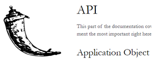

Deren Bozer
COSC-381 MW 11:00
Winter 2023

# CS50 - Flask

<strong>Question 1:</strong> Please use your own words to describe what is a design pattern, what is MVC.

<strong>Ans: A layout or plan that can be used to design, solve, or build software. A MVC is a type of design pattern that stands for Model-View-Controller.</strong>

<br>
<br>

<strong>Question 2:</strong> What Python decorators are used in the lecture?

<strong>Ans:</strong>
```
def index()
def greet()
```

<br>
<br>

<strong>Question 3:</strong> Please use your own words to describe what is `render_template`.

<strong>Ans: Render_Template is a function that can look for the given file and return it's contents. It's used in the video like this: </strong>`return render_template("index.html")`

<br>
<br>

<strong>Question 4:</strong> Please give the URL to the API documentation of Flask. The top of the webpage should look like this:



<strong>Ans:</strong> https://flask.palletsprojects.com/en/2.2.x/api/

<br>
<br>

<strong>Question 5:</strong> What happens if we change `@app.route("/")` to `@app.route("/hello")`?

<strong>Ans: The webpage will route to "/" by default. By changing the route parameter, the page will not load since "/" doesn't exist anymore. If you enter "/hello" in the URL, the page will load again.</strong>

<br>
<br>

<strong>Question 6:</strong> At 31:06 of the video, the professor demonstrated how to change the `name` to the `first_name`, which places did he change? How are those places connected?

<strong>Ans: What he changed & how they connect:</strong>
- Index HTML Form Input name and placeholder - the name of the form input and the placeholder to be displayed
- The py app GET parameter - the HTTP parameter that is grabbed from the URL
- The py app parameter - the parameter that gets passed into the template
- Template HTML output variable - the parameter from the py app

<br>
<br>

<strong>Question 7:</strong> Please complete the following method so that it is a route that accepts both GET and POST requests. For a GET request, the method assumes a URL parameter, `get_param`, and returns the value of `get_param`. For a POST request, the method assumes a form parameter, `post_param`, and returns the value of `post_param`.

```
@app.route("/") # please change the line if needed
def index():
    # todo: finish the method
```

<strong>Ans:</strong>
```
@app.route("/", methods=["GET", "POST"]) 
def index():
    if request.method == "GET":
        return get_param(get_param)
    if request.method == "POST":
        return post_param(post_param)
```

<br>
<br>

<strong>Question 8:</strong> Please use your words to answer: What is Jinja and why is it related to Flask?

<strong>Ans: Jinja is used to create templates that flask can use to render HTML. It can be used to avoid retyping the same lines for every HTML file.</strong>

<br>
<br>

<strong>Question 9:</strong> The second part of the lecture demonstrated how to build a registration system. In that system, which part of the code is the model in the MVC design pattern?

<strong>Ans: The model part is the part that defines the form and what's on it</strong>

