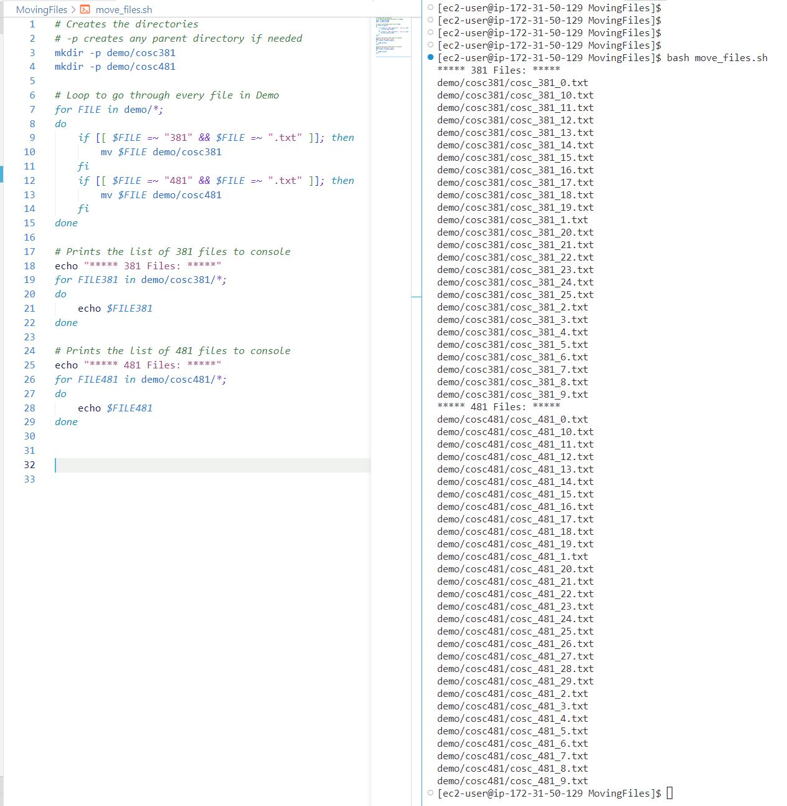

Deren Bozer
COSC-381 MW 11:00
Winter 2023

## Moving Files in Batch

#### Screenshot of the terminal output:



#### Script for bash file:
```
# Creates the directories
# -p creates any parent directory if needed
mkdir -p demo/cosc381
mkdir -p demo/cosc481

# Loop to go through every file in Demo
for FILE in demo/*; 
do 
    if [[ $FILE =~ "381" && $FILE =~ ".txt" ]]; then
        mv $FILE demo/cosc381
    fi
    if [[ $FILE =~ "481" && $FILE =~ ".txt" ]]; then
        mv $FILE demo/cosc481
    fi
done

# Prints the list of 381 files to console
echo "***** 381 Files: *****"
for FILE381 in demo/cosc381/*;
do
    echo $FILE381
done

# Prints the list of 481 files to console
echo "***** 481 Files: *****"
for FILE481 in demo/cosc481/*;
do
    echo $FILE481
done
```