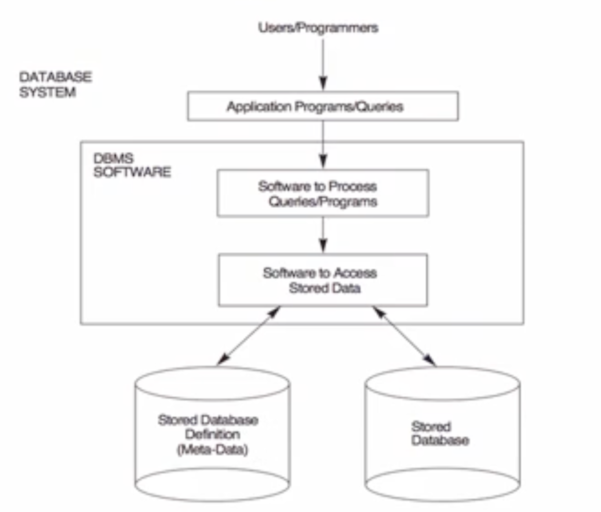
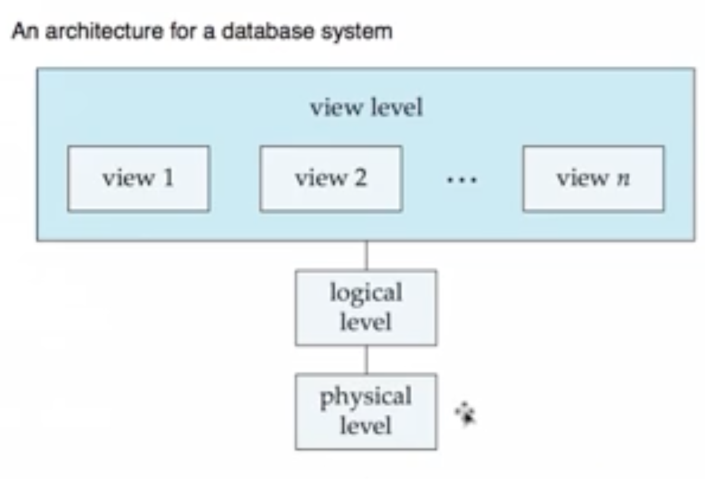

# 471 Database Principles

- Dr. Krish Narayanan
- Textbook
  - Database System Concepts
  - 6th Edition
  - Silberschatz A Korth, H., Sudarshan
- Wed 3:00-4:50
- Mon 02/20 3:00
- Mon 03/27 3:00

# Table of Contents

- [471 Database Principles](#471-database-principles)
- [Table of Contents](#table-of-contents)
- [Week 1, Chapter 1, Part 1](#week-1-chapter-1-part-1)
    - [Basics](#basics)
    - [Purpose of Database System](#purpose-of-database-system)
    - [Data Abstraction](#data-abstraction)
    - [Database Terminology](#database-terminology)
- [Week 1, Chapter 1, Part 2](#week-1-chapter-1-part-2)
    - [Relational Databases](#relational-databases)
    - [Database Languages](#database-languages)
    - [Database Design](#database-design)

# Week 1, Chapter 1, Part 1

### Basics

- Data
  - What is data: data is some known set of facts that have an implicit meaning in that given setting
- Database Management Systems (DBMS)
  - DBMS contains information about a particular enterprise
    - Collection of interrelated data
    - Set of programs to access the data
    - An environment that is both convenient and efficient to use
  - Database Applications
    - Banking - transactions
    - Airlines - reservations, schedules
    - Universities - registration, grades
- Database System
  - Combination of a database and a DBMS
- SQL
  - Structured Query Language
  - Language used to interact with a database
  - Query the database, interact with the database
- Database System:
  - 
- Meta Data (data dictionary)
  - data about data
  - information about the stored database
    - How many students are stored in the data type
    - maximum number of characters in a certain field
    - variable type 
  - DBMS uses meta data information for getting the right data
- Databases replaced file systems 

### Purpose of Database System

- Drawbacks of using file system to store data:
  - Data redundancy and inconsistency
    - Multiple file formats, duplication of information in different files
  - Difficulty in accessing data
    - Need to write a new program to carry out each task
  - Data isolation, multiple file formats
  - Integrity Problems
    - Integrity constraint become "buried" in program code rather than being stated explicitly
    - Hard to add new constraints or change existing ones
  - Atomicity of updates
    - Failures may leave database in an inconsistent state with partial updates carried out
    - Ex: transfer of funds from one account to another should either complete or not happen at all
  - Concurrent access by multiple users
    - Concurrent access needed for performance
    - Uncontrolled concurrent access can lead to inconsistencies
  - Security Problems
- **Advantages**
  - Controlled redundancy
    - Redundant data can still occur
    - DBMS manages the duplicates (controlled redundancy)
  - Self-describing nature of a database
    - if you want to know something about a database, check the meta data
  - Program-data independence
    - If you change the table structure of a database, it will not affect how the programs execute
    - it does not depend on how the database is structured
- **Disadvantages**
  - High Cost
    - Software, training, etc
  - Overhead
    - Security, concurrency, recovery
  - Simple, single-user application
    - Don't need to invest time and money if the purpose doesn't need it
  - Improperly designed by creators
    - Doesn't properly reflect the data
  - Real-time apps
    - Time constraints
- Database Transaction
  - a unit of work, that is supposed to do something with the database. Done as 1 entity
    - Read, write, 
    - Packaged as one unit
    - Either executed as 1 update or not at all

### Data Abstraction

- Levels of Abstraction:
  - Physical Level - Describes how a record (ex customer) is stored
  - Logical Level - Describes data stored in database, and the relationships among the data
  - View Level - application programs hide details of data types. Views can also hide information (such as an employee's salary) for security purposes
- Logical Level Example:
```
type instructor = record
    ID: string;
    name: string;
    dept_name: string;
    salary: integer;
  end;
```
- Architecture for a database system:


### Database Terminology

- DBMS - above
- Data Abstraction - above
- Schema - describes the database at each of the 3 levels
- Instance - the actual content
- Redundancy - data existing in multiple locations
- Metadata (Data dictionary) - data on the data
- Data model
- SQL - DDL & MDL
- Query Processing
- Transaction management
- DB Architecture - client/server, many more architectures, database backend GUI frontend
- DB users

# Week 1, Chapter 1, Part 2

### Relational Databases 

- Based on the concept of a table
- a collection of tables
- Putting together a set of these tables constitutes the database
- Also known as a "Record Based Model"
- Table
  - contains a set of rows and columns
  - Also known as a relation
  - Row 
    - aka: record, tuple
    - represents 1 entity, 1 item
  - Column
    - aka: attribute, field

### Database Languages

- Data Definition Language (DDL)
  - Notation for defining the database schema
  - DDL compiler generates a set of tables stored in a data dictionary
  - Data dictionary contains metadata (data about data)
    - Database schema
    - Integrity constraints
      - Primary Key 
      - Referential integrity
- Data Manipulation Language (DML)
  - Language for accessing and manipulating the data organized by the appropriate data model
    - DML also known as query language
  - 2 Classes of languages
    - Procedural - user specifies what data is required and how to get those data
    - Declarative - user specifies what data is required without specifying how to get those data
  - SQL is the most widely used query language
- SQL
  - widely used non-procedural language
  - application programs generally access databases through one of:
    - language extensions to allow embedded SQL
    - application program interface which allow SQL queries to be sent to a database

### Database Design

- the process of designing the general structure of the database
- Database Design Steps:
- **1) Conceptual Model:**
  - Trying to describe data based on concepts
  - Concepts:
    - Entities
    - Relationships
    - Constraints
  - Trying to describe data at a high level
  - Entity Relationship Model (ER Model), used to design
  - UML - Unified Modeling Language
- **2) Logical Model**
  - Deciding on the database scheme. Database design requires that we find a "good" collection of relation schema
  - Business Decision - what attributes should we record in the database?
  - Computer Science Decision - What relation schemes should we have and how should the attributes be distributed among the various relation schemas?
- **3) Physical Model**
  - Functional Dependencies - determining table design problems


